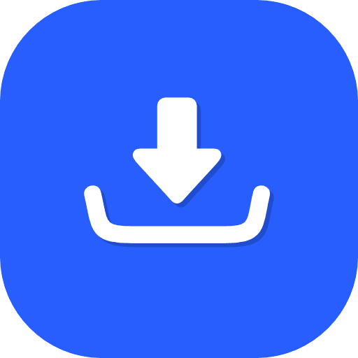

# Nexus Downloader 


A **modern, feature-rich video downloader** with glassmorphic UI, built with **PySide6**. Download videos, audio, and playlists from multiple platforms with an elegant and intuitive interface.



---

## ✨ Features

- 🎥 **Multi-Platform Support** — Download from YouTube, Twitch, and 500+ other platforms
- 🎵 **Format Selection** — Choose from multiple video/audio formats and quality levels
- 📺 **Channel Scraping** — Download entire channels or playlists in batch
- 🎨 **Modern UI** — Glassmorphic design with dark/light theme support
- 🔒 **License Validation** — Built-in license system with online verification
- 🔄 **Auto-Updates** — Automatic update checking and installation
- ⚙️ **Advanced Settings** — Customize downloads, proxies, and more
- 📊 **Smart Queue Management** — Pause, resume, and prioritize downloads
- 🌐 **Offline Support** — Graceful fallback when internet is unavailable

---

## 🚀 Quick Start

### Option 1: Download Pre-built Binary (Easiest)

1. Go to [Releases](../../releases)
2. Download `NexusDownloader.exe` (Windows) or appropriate binary for your OS
3. Run the executable
4. Done! No installation needed

### Option 2: Run from Source

**Requirements:** Python 3.10+

```bash
# Clone the repository
git clone https://github.com/yourusername/nexus-downloader.git
cd nexus-downloader

# Install dependencies
pip install -r requirements.txt

# Run the application
python main.py
```

### Option 3: Build Your Own Executable

```bash
# Install build tools
pip install pyinstaller

# Build the executable
pyinstaller NexusDownloader.spec

# Output will be in dist/ folder
cd dist
./NexusDownloader  # or NexusDownloader.exe on Windows
```

See [BUILD_README.md](BUILD_README.md) for detailed build instructions.

---

## 📖 Usage Guide

### Basic Download

1. **Paste URL** — Paste a video URL in the input field
2. **Select Format** — Choose video quality and audio format
3. **Choose Location** — Select where to save the file
4. **Download** — Click the download button and watch the progress

### Batch Downloads (Playlist/Channel)

1. Open the **Scraper** panel (⬇️ icon in the header)
2. Paste a playlist or channel URL
3. Configure format settings
4. Select videos you want
5. Click **Download All**

### License Setup

On first run, you'll be prompted for a license key:
- If you have a key, enter it
- If not, contact support or visit our website
- The app will work offline with cached validation

---

## ⚙️ System Requirements

| Component | Requirement |
|-----------|-------------|
| **OS** | Windows 7+, macOS 10.12+, or Linux (Ubuntu 18.04+) |
| **Python** | 3.10 or newer (only needed for source installation) |
| **RAM** | 512 MB minimum (1+ GB recommended) |
| **Disk** | 100 MB free space for installation |
| **Internet** | Required for updates and license validation |

---

## 📦 Dependencies

The application requires these Python packages (auto-installed):

```
PySide6       - Modern UI framework
yt-dlp        - Video downloading engine
requests      - HTTP library for updates/validation
packaging     - Version management
```

---

## 🔧 Configuration

Settings are stored in your user directory:

- **Windows:** `C:\Users\[YourName]\AppData\Roaming\NexusLabs\`
- **macOS:** `~/Library/Application Support/NexusLabs/`
- **Linux:** `~/.config/NexusLabs/`

You can manually edit `settings.json` to customize:
- Default download folder
- Preferred video quality
- Theme preference
- Proxy settings

---

## 🆘 Troubleshooting

### "No Internet Connection"
- Check your network connection
- Verify firewall isn't blocking the application
- Try clicking **Retry** in the dialog

### "License Invalid"
- Ensure you entered the correct license key
- Check that your license hasn't expired
- Contact support if you believe this is an error

### "Download Fails"
- Verify the URL is correct and publicly accessible
- Check available disk space
- Ensure you have write permissions to the download folder
- Try a different video if the platform is having issues

### Module Not Found Errors
```bash
# Reinstall dependencies
pip install --upgrade -r requirements.txt
```

### Building Fails
See [Troubleshooting section in BUILD_README.md](BUILD_README.md#troubleshooting)

---

## 📝 For Developers

### Project Structure

```
nexus-downloader/
├── main.py                 # Application entry point
├── main_window.py         # Main UI window
├── download_worker.py     # Download engine
├── channel_scraper.py     # Playlist/channel scraper
├── license_client.py      # License validation
├── auto_updater.py        # Update mechanism
├── settings_manager.py    # Configuration manager
├── themes.py              # UI themes
├── widgets/               # Custom UI components
│   ├── download_card.py
│   ├── format_panel.py
│   ├── scraper_panel.py
│   └── ...
├── requirements.txt       # Python dependencies
├── NexusDownloader.spec   # PyInstaller configuration
└── README.md             # This file
```

### Contributing

Contributions are welcome! Please:

1. Fork the repository
2. Create a feature branch (`git checkout -b feature/amazing-feature`)
3. Commit your changes (`git commit -m 'Add amazing feature'`)
4. Push to the branch (`git push origin feature/amazing-feature`)
5. Open a Pull Request

See [CONTRIBUTING.md](CONTRIBUTING.md) for detailed guidelines.

### Development Setup

```bash
# Create virtual environment
python -m venv venv
source venv/bin/activate  # On Windows: venv\Scripts\activate

# Install development dependencies
pip install -r requirements.txt
pip install pytest pylint black

# Run the application in debug mode
python main.py

# Run tests
pytest tests/

# Code formatting
black .
```

---

## 📄 License

This project is licensed under the **MIT License** — see the [LICENSE](LICENSE) file for details.

You are free to:
- ✅ Use commercially
- ✅ Modify the code
- ✅ Distribute copies
- ✅ Use privately

With the condition that you include the license and copyright notice.

---

## 🤝 Support

- **Bug Reports** — Use [GitHub Issues](../../issues)
- **Feature Requests** — Open an issue with the `enhancement` label
- **Questions** — Check [Discussions](../../discussions)
- **Email** — [your-email@example.com](mailto:your-email@example.com)

---

## 🙏 Acknowledgments

- Built with [PySide6](https://www.qt.io/qt-for-python) — Qt for Python
- Powered by [yt-dlp](https://github.com/yt-dlp/yt-dlp) — A fork of youtube-dl
- Icons from system theme

---

## 📊 Project Status

- ✅ Active Development
- ✅ Stable for Production Use
- ⏳ Version 8.x (current)
- 📅 Last Updated: March 2026

---

## Changelog

See [CHANGELOG.md](CHANGELOG.md) for version history and updates.

---

**Made with ❤️ by NexusLabs**

Give us a ⭐ if you find this project helpful!
